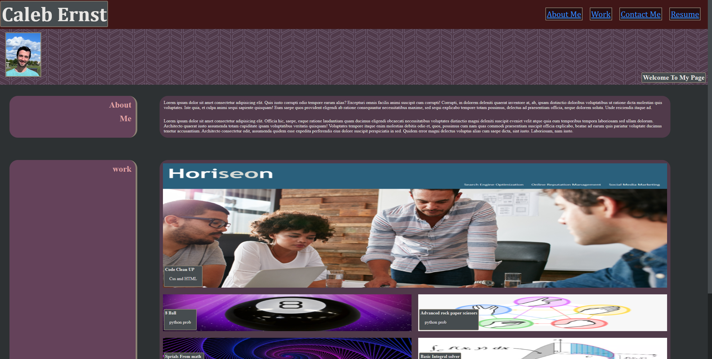

# My-Professional-Portfolio

This project is the creation of a basic portfolio that I will add to as I creat more projects that showcase my skill as a coder. I used html and CSS in this project in order to creat the bases for the webise and then give it some decortation and look nice. 

I learned a lot while making this. I got more comforitable with using flex to move elements around the  webpage to where I want them to be. I also learned a lot about how to make grids in order again for elements to apear where I want them to. I got much more comforatable with implementing links and picture. I also began to scratch the serface of changing the layout based on screen size but know I have a lot to learn going forward with this.

Here is a link to the webiste: https://caernst13.github.io/My-Professional-Portfolio/

Below are credits for different resorces I used during the creation of this web page.

code for the pattern right below the header is based off of code found here: https://css-tricks.com/a-few-background-patterns-sites/

code for grid where pictures are placed is found here: https://cssgrid-generator.netlify.app/